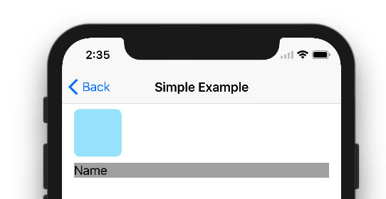
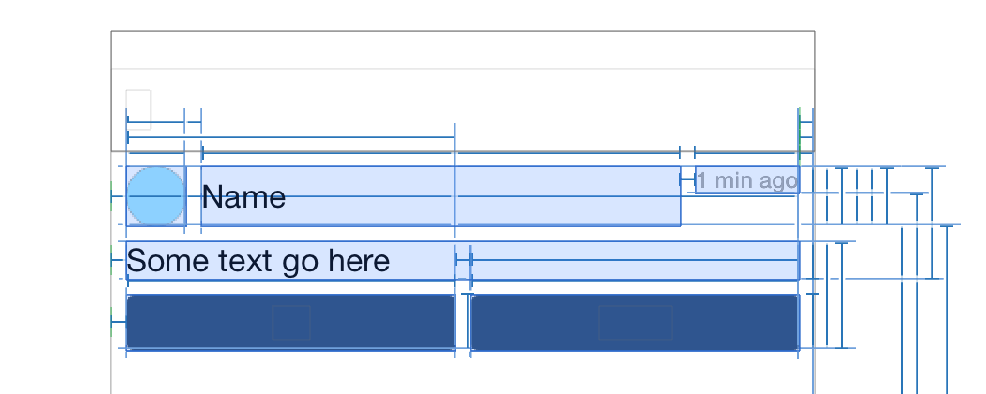

# NorthLayout

[](https://travis-ci.org/banjun/NorthLayout)
[](http://cocoapods.org/pods/NorthLayout)
[](http://cocoapods.org/pods/NorthLayout)
[](http://cocoapods.org/pods/NorthLayout)

The fast path to autolayout views in code

## Installation

NorthLayout is available through [CocoaPods](http://cocoapods.org). To install
it, simply add the following line to your Podfile:

```ruby
pod "NorthLayout"
```

## Usage

* `view.northLayoutFormat(_:_:)` to get autolayout closure for view
* `autolayout(...)` to layout with [Autolayout Visual Format Language](https://developer.apple.com/library/ios/documentation/UserExperience/Conceptual/AutolayoutPG/VisualFormatLanguage/VisualFormatLanguage.html)
* no storyboards required

(See also `Example`)

```swift
override func loadView() {
    super.loadView()

    view.backgroundColor = .whiteColor()

    let iconView = UIImageView(image: colorImage(UIColor(red: 0.63, green: 0.9, blue: 1, alpha: 1)))
    let iconWidth = CGFloat(32)
    iconView.layer.cornerRadius = iconWidth / 2
    iconView.clipsToBounds = true

    let nameLabel = UILabel()
    nameLabel.text = "Name"

    let dateLabel = UILabel()
    dateLabel.text = "1 min ago"
    dateLabel.font = UIFont.systemFontOfSize(12)
    dateLabel.textColor = UIColor.lightGrayColor()

    let textLabel = UILabel()
    textLabel.text = "Some text go here"

    let favButton = UIButton(type: .System)
    favButton.setTitle("⭐️", forState: .Normal)
    favButton.backgroundColor = UIColor(red: 0.17, green: 0.29, blue: 0.45, alpha: 1.0)
    favButton.setTitleColor(UIColor.whiteColor(), forState: .Normal)
    favButton.layer.cornerRadius = 4
    favButton.clipsToBounds = true

    let replyButton = UIButton(type: .System)
    replyButton.setTitle("Reply", forState: .Normal)
    replyButton.backgroundColor = favButton.backgroundColor
    replyButton.setTitleColor(UIColor.whiteColor(), forState: .Normal)
    replyButton.layer.cornerRadius = 4
    replyButton.clipsToBounds = true

    let autolayout = northLayoutFormat(["p": 8, "iconWidth": iconWidth], [
        "icon": iconView,
        "name": nameLabel,
        "date": dateLabel,
        "text": textLabel,
        "fav": favButton,
        "reply": replyButton,
        ])
    autolayout("H:|-p-[icon(==iconWidth)]-p-[name]-p-[date]-p-|")
    autolayout("H:|-p-[text]-p-|")
    autolayout("H:|-p-[fav]-p-[reply(==fav)]-p-|")
    autolayout("V:|-p-[icon(==iconWidth)]-p-[text]")
    autolayout("V:|-p-[name(==icon)]")
    autolayout("V:|-p-[date]")
    autolayout("V:[text]-p-[fav]")
    autolayout("V:[text]-p-[reply]")
}
```

the code generates a layout:



with constraints:



## The Name

NorthLayout is named after where it was cocoapodized, [Lake Toya](http://en.wikipedia.org/wiki/Lake_Tōya) in the North prefecture of Japan, the setting of [Celestial Method](http://en.wikipedia.org/wiki/Celestial_Method).

## License

NorthLayout is available under the MIT license. See the LICENSE file for more info.
